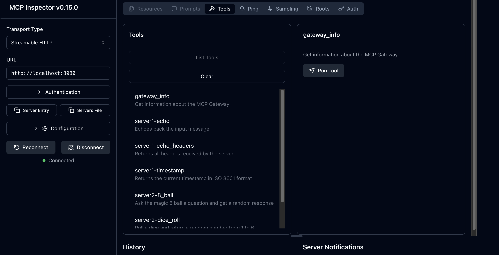

# MCP Helper PoC

MCP Helper with Go Envoy external processor.

## Run

```bash
docker-compose up --build
```

Available at: http://localhost:8080

Run mcp-inspector:

```bash
DANGEROUSLY_OMIT_AUTH=true npx @modelcontextprotocol/inspector
```

Open mcp-inspector at http://127.0.0.1:6274/?transport=streamable-http&serverUrl=http://localhost:8080#tools

After connecting and listing tools, you should see something like this with tools from either server:


